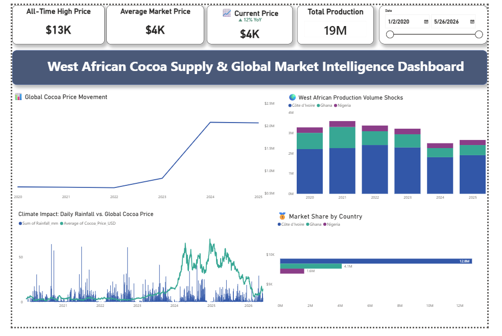

# Cocoa Supply Chain Market Intelligence

This project shows how I collected, cleaned, and visualized cocoa market data for a supply-chain dashboard.

## What this project does
* **Extracts live cocoa futures prices** from Yahoo Finance using Python.
* **Fetches historical rainfall data** for Côte d'Ivoire using the Open-Meteo archive API.
* **Merges market and weather data** into a clean database structure (`clean_cocoa_weather_data.csv`).
* **Integrates regional production volumes** for primary West African producers (`regional_production.csv`).
* **Visualizes interactive insights** using an advanced, enterprise-grade **Power BI dashboard** (`coccoa.pbix`).

## Dashboard preview

This screenshot is part of the project presentation, and the actual extraction and dashboard code is included in the repository files listed below.

## Key files
- extract_data.py — downloads raw cocoa market data
- merge_weather_prices.py — merges cocoa prices with rainfall data
- update_regional_production.py — adds regional production data
- prepare_dashboard_data.py — prepares all dashboard input files
- app.py — Streamlit dashboard interface
- screenshots/ — folder for the Power BI dashboard screenshot used in this project

## How to reproduce the data extraction
1. Install dependencies:
   py -3 -m pip install -r requirements.txt

2. Generate the dashboard data files:
   py -3 prepare_dashboard_data.py

3. Start the dashboard:
   streamlit run app.py

## What I built myself
This repository includes the actual data extraction and preparation steps I used to build the dashboard, so recruiters can see the end-to-end workflow from raw market data to the final dashboard visuals.
